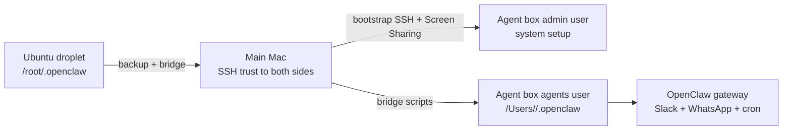
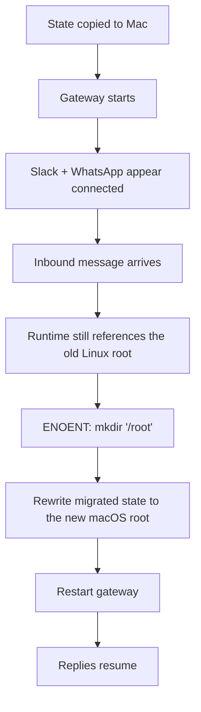

We recently moved a live OpenClaw agent off an Ubuntu droplet and onto a local Mac that now serves as a dedicated agent workstation. The surprising part was not installing OpenClaw on macOS. The hard part was preserving the long-lived state that made the agent useful in the first place: WhatsApp sessions, Slack auth, cron definitions, Google client secrets, 1Password service-account config, and the runtime session files OpenClaw had already accumulated.

This guide is the runbook I wish we had before we started. It is based on the real migration path we executed, but everything here is sanitized. Hostnames, IP addresses, usernames, email addresses, and secrets have been replaced with placeholders.

If you are moving an agent from a cloud Ubuntu box to a local Mac, this is the sequence I would follow now.

## The System Topology

We ended up with three machines and two macOS users:

- **Ubuntu source droplet**: the old OpenClaw runtime, usually rooted under `/root/.openclaw`
- **Main Mac**: your everyday workstation that can SSH into both the Ubuntu source and the Mac agent box
- **Agent box Mac**: the destination Mac that will run OpenClaw full-time
- **Agent box admin user**: your admin macOS account for Homebrew, system settings, and remote access
- **Agent box agents user**: a separate standard macOS account for the actual AI agent identity and browser state

The article intentionally includes both SVG and Mermaid versions of the diagrams. The SVGs are publishing-friendly, and the Mermaid blocks keep the diagrams editable in Git.




## What Actually Matters to Preserve

Do not think about this as "move the repo." Think about it as "move the runtime state."

### Critical state to preserve

- `~/.openclaw/openclaw.json`
- `~/.openclaw/.env.1password`
- `~/.openclaw/credentials/whatsapp/`
- `~/.openclaw/cron/jobs.json`
- `~/.openclaw/secrets/google-client-secret.json`
- `~/.openclaw/identity/`

### Important state that saves time

- `~/.config/gogcli/`
- `~/.openclaw/agents/`
- `~/.openclaw/devices/`
- `~/.openclaw/credentials/slack-*.json`
- `~/.openclaw/credentials/whatsapp-*.json`

### State I would not copy

- `~/.config/gh/`
- your Ubuntu private SSH key
- your personal macOS SSH key for admin use
- the entire Ubuntu home directory unless you have no better inventory

For GitHub on the destination Mac, create a new SSH key and run `gh auth login` again under the destination user. That is cleaner than copying the VPS private key.

## The Migration Order That Worked

1. Prepare the destination Mac under the admin user.
2. Bootstrap SSH from the main Mac to the destination Mac.
3. Log in to the `agents` macOS user locally once.
4. Set up the `agents` user's GitHub identity separately.
5. Copy OpenClaw state from Ubuntu to the destination Mac.
6. Install OpenClaw on the destination Mac.
7. Repair stale Linux path references inside OpenClaw state.
8. Restart the gateway and validate Slack and WhatsApp.
9. Only after validation, decommission the droplet.

That last part matters. We had a point where `openclaw status` looked healthy, Slack and WhatsApp showed as connected, and replies still failed at runtime because old session files were still trying to write to `/root`.

## Why the First Attempt Failed

On the first pass, the migration looked good:

- the full `~/.openclaw` directory copied over
- `openclaw status` showed Slack and WhatsApp as `ON`
- the gateway launched on the Mac

But the agent still failed to reply. The actual runtime error was:

```text
ENOENT: no such file or directory, mkdir '/root'
```

The issue was not Slack auth. It was stale path references embedded in migrated session state. Some of the copied files still pointed at Linux paths like `/root/.openclaw`, so inbound messages crashed before delivery.


Here is the failure chain:



The companion script [`scripts/07-rewrite-openclaw-paths-for-macos.sh`](https://github.com/shakacode/sc-articles/blob/0feb8c8a38e354726cf445be8e7760e4e8c308ec/ai/openclaw-ubuntu-droplet-to-local-mac/scripts/07-rewrite-openclaw-paths-for-macos.sh) exists specifically because of that failure.

## Step 1: Prepare the Agent Box Mac

Run the admin bootstrap script on the destination Mac as your admin macOS user:

- [`scripts/01-quick-start-agent-box-admin.sh`](https://github.com/shakacode/sc-articles/blob/0feb8c8a38e354726cf445be8e7760e4e8c308ec/ai/openclaw-ubuntu-droplet-to-local-mac/scripts/01-quick-start-agent-box-admin.sh)

What it does:

- installs Homebrew if missing
- installs `git`, `gh`, `node`, `python`, and `tmux`
- enables FileVault and the firewall
- disables sleep for an unattended workstation
- creates the `agents` standard user if needed
- installs `@anthropic-ai/claude-code` and `@openai/codex`
- enables Screen Sharing

What it cannot do automatically:

- enable **Remote Login** in macOS Sharing settings
- complete `gh auth login`
- create the first GUI session for the `agents` user

That first local GUI login matters. In our migration, Screen Sharing user switching was flaky until the `agents` account had completed one real login on the Mac itself.

## Step 2: Bootstrap SSH from the Main Mac

Run this on your main Mac:

- [`scripts/02-quick-start-main-machine.sh`](https://github.com/shakacode/sc-articles/blob/0feb8c8a38e354726cf445be8e7760e4e8c308ec/ai/openclaw-ubuntu-droplet-to-local-mac/scripts/02-quick-start-main-machine.sh)

This script fixes several problems we hit in the original version:

- it does not assume only `id_ed25519` exists
- it can fall back to `id_rsa`
- it rewrites `~/.ssh/config` with explicit host aliases
- it adds the main Mac public key to the destination Mac's `authorized_keys`
- it verifies a non-interactive SSH round-trip at the end

That last step is important. A script that merely copies keys is not good enough. It must prove SSH works without prompting.

It also **does not** copy the main Mac's private key to the destination Mac by default. If the destination admin user needs GitHub access, generate a fresh key on that Mac or opt in explicitly to key sharing with full awareness of the trade-off.

### Why `.local` hostnames were a trap

Bonjour hostnames are convenient until they are not. If the destination Mac's `.local` hostname is flaky, rerun with:

```bash
AGENT_BOX_HOST=<ip-or-tailnet-name> bash scripts/02-quick-start-main-machine.sh
```

In our case, the failure was not the hostname itself. The deeper issue was that the original script copied keys to the Mac but never actually authorized the main Mac's key for login.

## Step 3: Set Up the `agents` User

Log in once to the `agents` user locally on the destination Mac. Then run:

- [`scripts/03-quick-start-agents-user.sh`](https://github.com/shakacode/sc-articles/blob/0feb8c8a38e354726cf445be8e7760e4e8c308ec/ai/openclaw-ubuntu-droplet-to-local-mac/scripts/03-quick-start-agents-user.sh)

This sets up:

- `~/.npm-global`
- Homebrew in the `agents` shell path
- `@anthropic-ai/claude-code`
- `playwright` and Chromium

If your agent account needs its own GitHub identity, do not reuse the admin user's key or `gh` session.

## Step 4: Bootstrap the Agent's GitHub Identity

Run this as the `agents` user:

- [`scripts/04-bootstrap-agent-github.sh`](https://github.com/shakacode/sc-articles/blob/0feb8c8a38e354726cf445be8e7760e4e8c308ec/ai/openclaw-ubuntu-droplet-to-local-mac/scripts/04-bootstrap-agent-github.sh)

This script:

- sets `git config --global user.name`
- sets `git config --global user.email`
- generates a new `ed25519` key if one does not exist
- runs `gh auth login`
- verifies `ssh -T git@github.com`

We intentionally used a **new** SSH key on the Mac instead of copying the Ubuntu key. That gave the agent the same GitHub identity, but not the same private key material.

## Step 5: Copy OpenClaw State

There are two ways to do this.

### Option A: direct copy from the `agents` user

- [`scripts/05-migrate-openclaw-state-direct.sh`](https://github.com/shakacode/sc-articles/blob/0feb8c8a38e354726cf445be8e7760e4e8c308ec/ai/openclaw-ubuntu-droplet-to-local-mac/scripts/05-migrate-openclaw-state-direct.sh)

Use this only if the `agents` account on the destination Mac already has SSH trust to the Ubuntu source.

### Option B: bridge through the main Mac

- [`scripts/06-bridge-openclaw-state.sh`](https://github.com/shakacode/sc-articles/blob/0feb8c8a38e354726cf445be8e7760e4e8c308ec/ai/openclaw-ubuntu-droplet-to-local-mac/scripts/06-bridge-openclaw-state.sh)

This is the path we actually ended up using. It was better because:

- the main Mac already trusted the Ubuntu droplet
- the main Mac already trusted the destination Mac
- the `agents` user did not need direct SSH access to the Ubuntu source

That bridge script copies:

- `~/.openclaw`
- optionally `~/.config/gogcli`

It also reapplies restrictive permissions on the destination side.

Treat `~/.config/gogcli` as "worth copying, but not guaranteed portable." In many cases it saves a full Google re-auth flow. In some cases you will still need to re-authorize Gmail or Calendar on the new machine.

## Step 5.5: Make a Separate Backup Before You Decommission Anything

Run this on the main Mac:

- [`scripts/09-backup-openclaw-from-source.sh`](https://github.com/shakacode/sc-articles/blob/0feb8c8a38e354726cf445be8e7760e4e8c308ec/ai/openclaw-ubuntu-droplet-to-local-mac/scripts/09-backup-openclaw-from-source.sh)

That gives you one more safety net outside the destination Mac itself. In our migration, having a separate local backup made the final decommission decision much easier.

## Step 6: Install OpenClaw on the Destination Mac

The exact package or versioning flow will vary based on your OpenClaw install method, but the high-level sequence is:

```bash
eval "$(/opt/homebrew/bin/brew shellenv)"
export PATH="$HOME/.npm-global/bin:$PATH"
npm install -g openclaw
openclaw doctor --fix
```

The `doctor --fix` step mattered for us because the migrated config still contained an obsolete key under `messages.tts.edge`.

## Step 7: Rewrite Linux Paths to macOS Paths

This was the decisive repair step.

Run:

- [`scripts/07-rewrite-openclaw-paths-for-macos.sh`](https://github.com/shakacode/sc-articles/blob/0feb8c8a38e354726cf445be8e7760e4e8c308ec/ai/openclaw-ubuntu-droplet-to-local-mac/scripts/07-rewrite-openclaw-paths-for-macos.sh)

What it rewrites:

- `~/.openclaw/openclaw.json`
- `~/.openclaw/agents/main/sessions/sessions.json`
- `~/.openclaw/exec-approvals.json`
- `~/.openclaw/cron/jobs.json`
- every `*.jsonl` file under `~/.openclaw/agents/main/sessions/`

It also:

- creates timestamped backups of any file it edits
- runs `openclaw doctor --fix` if the CLI is present
- searches for remaining references to the old Linux path

If your Ubuntu runtime used `/home/ubuntu/.openclaw` instead of `/root/.openclaw`, override the source root when you run it:

```bash
SOURCE_ROOT=/home/ubuntu/.openclaw TARGET_ROOT="$HOME/.openclaw" \
  bash scripts/07-rewrite-openclaw-paths-for-macos.sh
```

## Step 8: Validate the Migration

Run:

- [`scripts/08-verify-openclaw-migration.sh`](https://github.com/shakacode/sc-articles/blob/0feb8c8a38e354726cf445be8e7760e4e8c308ec/ai/openclaw-ubuntu-droplet-to-local-mac/scripts/08-verify-openclaw-migration.sh)

This script checks:

- required directories exist
- the old Linux path does not remain in critical state
- `openclaw status` runs
- `openclaw gateway status` runs

Then do two manual probes:

1. Send a Slack message to the migrated agent.
2. Send a WhatsApp message to the migrated agent.

In our migration, this was the only validation that really mattered. Slack and WhatsApp both had to receive and reply after the path rewrite.

## The Companion Scripts

All scripts for this runbook are in [`scripts/`](https://github.com/shakacode/sc-articles/blob/0feb8c8a38e354726cf445be8e7760e4e8c308ec/ai/openclaw-ubuntu-droplet-to-local-mac/scripts/).

| Script | Where to run it | Purpose |
| --- | --- | --- |
| `01-quick-start-agent-box-admin.sh` | destination Mac admin user | system prep, Homebrew, tools, sharing |
| `02-quick-start-main-machine.sh` | main Mac | SSH bootstrap to the destination Mac |
| `03-quick-start-agents-user.sh` | destination Mac `agents` user | npm-global, Claude Code, Playwright |
| `04-bootstrap-agent-github.sh` | destination Mac `agents` user | new SSH key + `gh auth login` |
| `05-migrate-openclaw-state-direct.sh` | destination Mac `agents` user | direct SSH copy from Ubuntu |
| `06-bridge-openclaw-state.sh` | main Mac | bridge copy from Ubuntu to the destination Mac |
| `07-rewrite-openclaw-paths-for-macos.sh` | destination Mac `agents` user | repair stale `/root/.openclaw` references |
| `08-verify-openclaw-migration.sh` | destination Mac `agents` user | post-migration verification |
| `09-backup-openclaw-from-source.sh` | main Mac | make a second local backup before decommissioning |

There is also a [`scripts/README.md`](https://github.com/shakacode/sc-articles/blob/0feb8c8a38e354726cf445be8e7760e4e8c308ec/ai/openclaw-ubuntu-droplet-to-local-mac/scripts/README.md) with the same order in a shorter form.

## Redaction and Security Rules

If you turn your real migration notes into a reusable document, sanitize these categories before publishing:

- public IP addresses
- `.local` hostnames
- personal email addresses
- phone numbers used for WhatsApp probes
- Slack user IDs and channel IDs
- Google OAuth client IDs
- 1Password service-account tokens
- anything under `credentials/`, `identity/`, or `.env.*`

I also recommend never publishing raw copies of:

- `openclaw.json`
- `.env.1password`
- `google-client-secret.json`
- any real session archive under `agents/main/sessions/`

Use placeholders like:

- `ubuntu-openclaw.example.com`
- `agent-box.local`
- `adminuser`
- `agents`
- `agent@company.com`

## The Screen Sharing Quirk We Hit

This migration had one annoying macOS wrinkle unrelated to OpenClaw itself.

Screen Sharing worked reliably to the admin user's desktop first. Switching into the `agents` GUI session remotely was flaky until the `agents` account had completed one real local login. If the remote session went black during user switching, the shortest path forward was:

1. log into the `agents` user locally on the Mac
2. let the desktop initialize completely
3. reconnect Screen Sharing

I would not burn a lot of time fighting that remotely on first boot.

## Decommission Checklist for the Ubuntu Droplet

Do not destroy the droplet until all of this is true:

- the full OpenClaw state exists on the destination Mac
- the workspace repository is cloned on the destination Mac and up to date
- you have a second offline or local backup
- Slack replies work
- WhatsApp replies work
- cron jobs are present
- the gateway starts cleanly after a restart

If you want the safest cutover, power the droplet off for 24 hours before deleting it. If the local Mac handles live traffic for a day without surprises, the droplet is no longer your runtime.

## What I Would Do Differently Next Time

- Inventory state before touching the destination Mac.
- Assume the bridge copy will be easier than direct SSH from the destination user.
- Treat `openclaw doctor --fix` as mandatory after migration.
- Search for stale Linux roots inside all session state before sending the first real message.
- Validate with live Slack and WhatsApp probes before declaring success.

That is the sequence I would trust now.

Aloha,
Justin

---

*If your team is moving long-lived AI agents between environments and wants help making the cutover boring, [we should talk](https://www.shakacode.com).*
